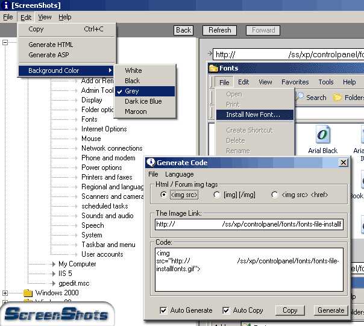



## \[ScreenShots\] \- For techs everywhere

### Description

Ever need a Screen Shot to show on the web or email to a client but hate the hassle of having to take the screenshot, import it, save it to your computer then upload it to a server? Well this program takes that out of the picture, by having all of your screenshots listed and easy to get to with a few click of the mouse. All screen shots are hosted on your server or your host for that matter. With the direct link shown above the image to make it easy to link, or display in a support forum. This code doesn't use a database, so its much easier to understand, and setup. If you like it then please vote & leave a comment! Thanks.. Make sure to read the read me it explains how to set it up!
 
### More Info
 
IIS installed, or know the directory of the asp script on your host.

             |
---                |---
**Submitted On**   |2002-02-25 06:01:56
**By**             |[snowboardr](https://github.com/Planet-Source-Code/PSCIndex/blob/master/ByAuthor/snowboardr.md)
**Level**          |Intermediate
**User Rating**    |4.7 (99 globes from 21 users)
**Compatibility**  |VB 5\.0, VB 6\.0, ASP \(Active Server Pages\) 
**Category**       |[Complete Applications](https://github.com/Planet-Source-Code/PSCIndex/blob/master/ByCategory/complete-applications__1-27.md)
**World**          |[Visual Basic](https://github.com/Planet-Source-Code/PSCIndex/blob/master/ByWorld/visual-basic.md)
**Archive File**   |[\[ScreenSho575132252002\.zip](https://github.com/Planet-Source-Code/snowboardr-screenshots-for-techs-everywhere__1-32109/archive/master.zip)

